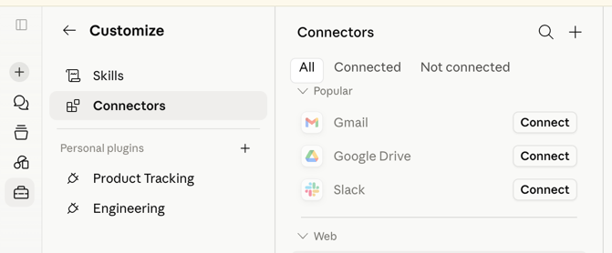
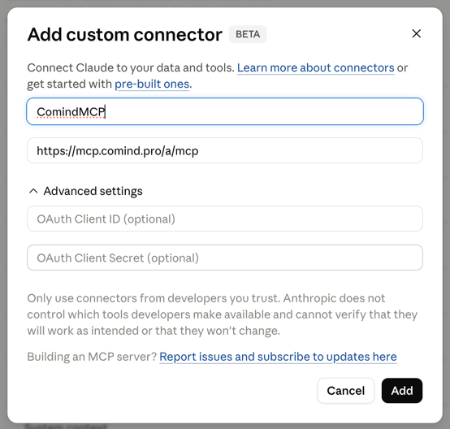
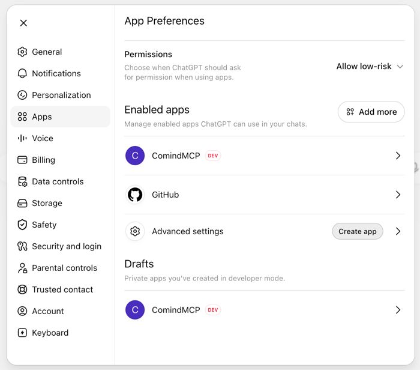
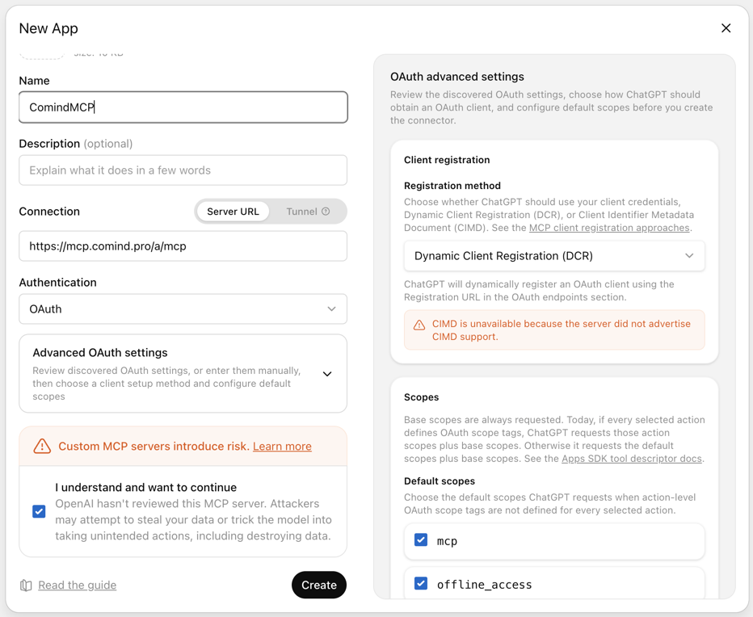
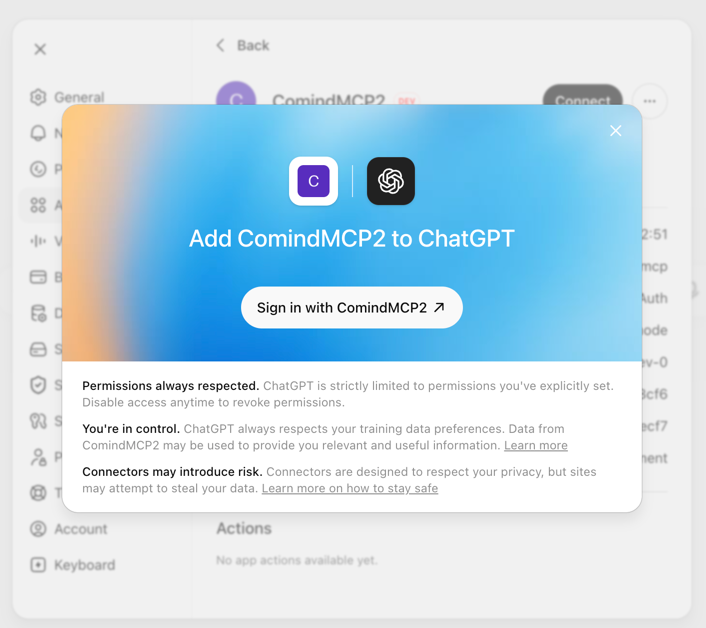
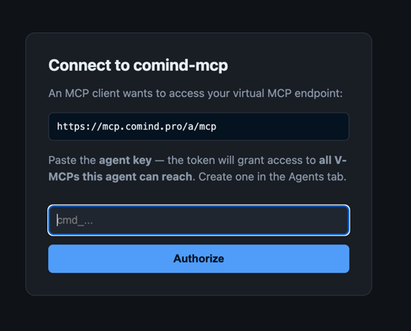
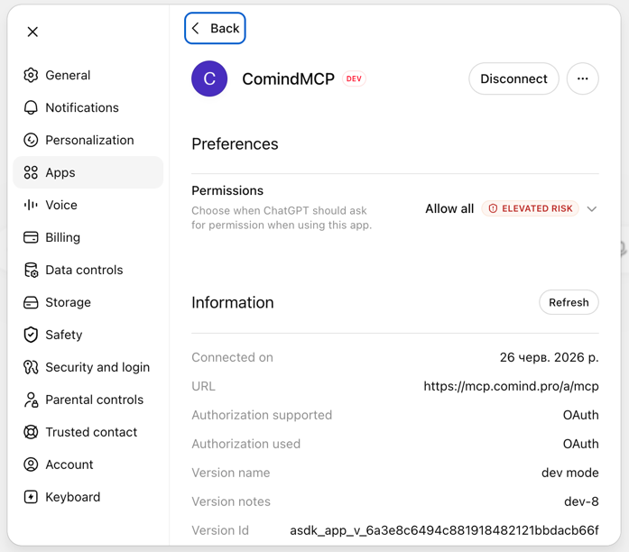

# Connecting comind-mcp to Claude and ChatGPT

Comind exposes your agent's tools as a remote MCP server. Any MCP-capable client can connect to it:

| Endpoint | Scope |
|---|---|
| `https://mcp.comind.pro/a/mcp` | **Agent-wide** — the union of tools across every V-MCP group the agent can reach. Use this for web connectors. |
| `https://mcp.comind.pro/g/<group>/mcp` | One V-MCP group only. |

You'll need an **agent key** (`cmd_…`). Create one in the Comind web UI → **Agents** tab → your agent → *Keys*. The key decides which tools the connector sees; treat it like a password.

---

## Claude (claude.ai web)

1. Open [claude.ai/customize/connectors](https://claude.ai/customize/connectors), then click **+** → **Add custom connector**.

   

2. Fill in the form and click **Add**:
   - **Name:** `ComindMCP` (anything you like)
   - **Remote MCP server URL:** `https://mcp.comind.pro/a/mcp`
   - Leave *OAuth Client ID / Secret* empty — Claude registers itself automatically (Dynamic Client Registration).

   

3. Click **Connect** on the new connector. Claude redirects you to the Comind consent page — paste your **agent key** (`cmd_…`) and press **Authorize**.

4. You're back in Claude with the connector **Connected**. Open a new chat, and the agent's tools are available (toggle them per-chat via the tools menu).

> If the connector card shows "Connection issue" before you connect, ignore it and press **Connect** anyway — the OAuth flow is what matters.

## Claude Code (CLI)

No OAuth needed — a static key works:

```bash
claude mcp add comind --transport http https://mcp.comind.pro/a/mcp \
  --header "Authorization: Bearer cmd_YOUR_AGENT_KEY"
```

Or with OAuth (the browser consent page will ask for the agent key):

```bash
claude mcp add comind --transport http https://mcp.comind.pro/a/mcp
```

---

## ChatGPT (web)

Custom MCP apps require **Developer mode**: Settings → **Apps** → **Advanced settings** → enable developer mode.

1. Open [chatgpt.com → Settings → Apps & Connectors](https://chatgpt.com/#settings/Connectors) and click **Create app** (under *Advanced settings*).

   

2. Fill in the **New App** form and click **Create**:
   - **Name:** `ComindMCP`
   - **Connection:** *Server URL* → `https://mcp.comind.pro/a/mcp`
   - **Authentication:** *OAuth*
   - Under *OAuth advanced settings* keep **Dynamic Client Registration (DCR)** and the default scopes (`mcp`, `offline_access`)
   - Tick *I understand and want to continue*

   

3. ChatGPT shows the connect dialog — click **Sign in with ComindMCP**.

   

4. On the Comind consent page, paste your **agent key** (`cmd_…`) and press **Authorize**.

   

5. Done — the app shows as connected, with the endpoint and OAuth details visible under *Information*.

   

---

## Troubleshooting

- **"Couldn't connect to the server" / probe errors** — if your MCP host sits behind Cloudflare (or another WAF), make sure AI agents are not blocked: the clients connect with `Claude-User` / `ChatGPT-User` user-agents, which "Block AI bots" rules reject at the edge. Verify with `curl -A "Claude-User" -X POST https://<host>/a/mcp` — you should get `401`, not `403`.
- **"Invalid agent key" on the consent page** — the key was mistyped or archived; create a fresh one in the Agents tab.
- **Connector connects but shows no tools** — the agent has no groups granted, or the group's tools are hidden. Check the agent's group grants and tool visibility, then start a new chat (clients cache `tools/list` per session).
